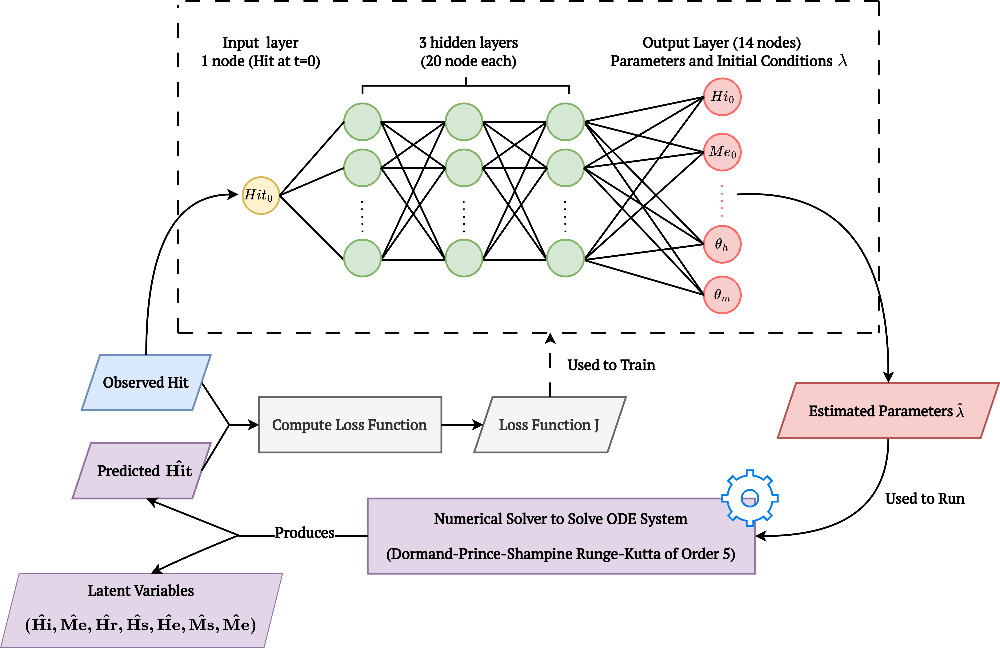
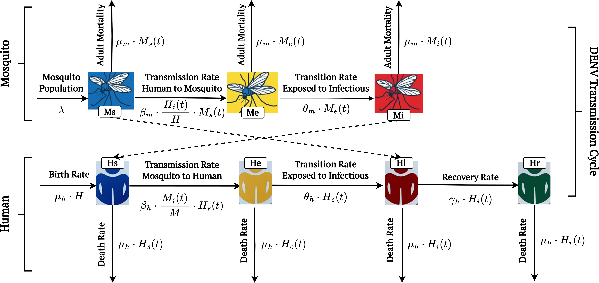

# Neural Parameter Calibration for Dengue Outbreak Forecasting 
### Viet Hoang Pham, Trung Dang Khuong Nguyen, Thirumalaisamy P. Velavan, Duc Khanh Tran

--- 
[](https://www.python.org/downloads/release/python-3100/)
[](https://www.python.org/downloads/release/python-3110/)

<div style="text-align: center;">
  
</div>
<div style="text-align: center;">
  
</div>

$$
\begin{aligned}
    \frac{dMs(t)}{dt} &= \lambda - \beta_{m} \cdot \frac{Hi(t)}{H} \cdot Ms(t) - \mu_m \cdot Ms(t) \\
    \frac{dMe(t)}{dt} &= \beta_{m} \cdot \frac{Hi(t)}{H} \cdot Ms(t) - (\theta_m + \mu_m) \cdot Me(t) \\
    \frac{dMi(t)}{dt} &= \theta_{m} \cdot Me(t) - \mu_m \cdot Mi(t) \\
    \frac{dHs(t)}{dt} &= \mu_{h} \cdot H - \beta_{h} \cdot \frac{Mi(t)}{M(t)} \cdot Hs(t) - \mu_h \cdot Hs(t) \\
    \frac{dHe(t)}{dt} &= \beta_{h} \cdot \frac{Mi(t)}{M(t)} \cdot Hs(t) - (\theta_h + \mu_h) \cdot He(t) \\
    \frac{dHi(t)}{dt} &= \theta_{h} \cdot He(t) - (\gamma_h + \mu_h) \cdot Hi(t) \\
    \frac{dHr(t)}{dt} &= \gamma_{h} \cdot Hi(t) - \mu_h \cdot Hr(t)
\end{aligned}
$$


This project focuses on calibrating the parameters of an Ordinary Differential Equations (ODE) system to improve Dengue Outbreak forecasting with the help of a neural network. The repository includes all code and models featured in our publications related to this subject, along with the scripts used for generating figures.

Our implementation largely depends on the implementations of the following publications:
- T. Gaskin, G. Pavliotis, M. Girolami. *Neural parameter calibration for large-scale multiagent models.* PNAS **120**, 7, 2023.
https://doi.org/10.1073/pnas.2216415120 (`HarrisWilson` and `SIR` models)

- Sensitivity, uncertainty and identifiability analyses to define a dengue transmission model with real data of an endemic municipality of Colombia
Lizarralde-Bejarano DP, Rojas-Díaz D, Arboleda-Sánchez S, Puerta-Yepes ME (2020) Sensitivity, uncertainty and identifiability analyses to define a dengue transmission model with real data of an endemic municipality of Colombia. PLOS ONE 15(3): e0229668. https://doi.org/10.1371/journal.pone.0229668

This project utilizes the [utopya package](https://docs.utopia-project.org/html/index.html) to manage simulation configuration, data handling, and visualization. The README provides introductory information about installation and a basic usage guide, enabling users to run models, recreate plots, and explore the codebase. For detailed, model-specific instructions, refer to the relevant README files under models/Dengue/README.md. Comprehensive guidance on using Utopia and utopya for running simulations is available in the [official documentation](https://docs.utopia-project.org/html/getting_started/tutorial.html#tutorial). Throughout the included [Tutorial](#tutorial) section, links to further resources are provided, which are recommended for those interested in extending the model or building new ones using this framework.


### Contents of this README
* [How to install](#installation)
  * [Installation on Windows](#installation-on-windows) 
* [Tutorial](#tutorial)
  * [How to run a model](#how-to-run-a-model)
  * [Run on different datasets](#run-on-different-datasets)
  * [Parameter sweeps](#parameter-sweeps)
  * [Adjusting the neural net configuration](#adjusting-the-neural-net-configuration)
  * [Training settings](#training-settings)
    * [Changing the loss function](#changing-the-loss-function)
    * [Loading data](#loading-data)
  * [Models overview](#models-overview)

---
# Installation
> [!WARNING]
> utopya is currently only fully supported on Unix systems (macOS and Ubuntu). For Windows
> installation instructions, see below; be aware that utopya for Windows is currently work in progress.

#### 1. Clone this repository
Clone this repository using a link obtained from 'Code' button (for non-developers, use HTTPS):

```commandline
git clone <GIT-CLONE-URL>
```

#### 2. Install requirements
The following command will install the [utopya package](https://gitlab.com/utopia-project/utopya) and the utopya CLI
from [PyPI](https://pypi.org/project/utopya/), as well as all other requirements:

```commandline
pip install -r requirements.txt
```

If this error exist "ModuleNotFoundError: No module named 'ruamel.yaml'", please reinstall the library
```commandline
python3 -m pip install --force-reinstall ruamel.yaml
```

This assumes your current directory is the project folder.
You should now be able to invoke the utopya CLI:
```commandline
utopya --help
```

> [!NOTE] 
> Enabling CUDA for PyTorch requires additional packages, e.g. `torchvision` and `torchaudio`.
> Follow [these](https://pytorch.org/get-started/locally/) instructions to enable GPU training.
> For Apple Silicon, follow [these](https://PyTorch.org/blog/introducing-accelerated-pytorch-training-on-mac/)
> installation instructions. Note that GPU acceleration for Apple Silicon is still work in progress and many functions have not
> yet been implemented.

#### 3. Register the project and all models with utopya

In the project directory (i.e. this one), register the entire project and all its models using the following command:
```commandline
utopya projects register . --with-models
```
You should get a positive response from the utopya CLI and your project should appear in the project list when calling:
```commandline
utopya projects ls
```
Done! 🎉

> [!IMPORTANT]
> Any changes to the project info file need to be communicated to utopya by calling the registration command anew.
> You will then have to additionally pass the `````--exists-action overwrite````` flag, because a project of that name already exists.
> See ```utopya projects register --help``` for more information.
```commandline
utopya projects register . --with-models --exists-action overwrite
```

#### 4. (Optional, but recommended) Install latex
To properly display mathematical equations and symbols in the plots, we recommend installing latex. However, latex distributions
are typically quite large, so ensure you have enough space on your disk.

On Ubuntu, first install latex by running
```commandline
sudo apt-get install texlive-latex-extra texlive-fonts-recommended dvipng cm-super
```
For macOS, install latex via a package manager, e.g. Homebrew or ports.

For both operating systems, also run the following command from within the virtual environment:
```commandline
pip install latex
```
Thereafter, set the plots to use latex by changing the following entry in the `base_plots.yaml` file of the model:
```yaml
.default_style:
  style:
    text.usetex: True
  # Keep everything else unchanged
```
Latex will then be used in *all* model plots. You can also change this individually for each plot.

#### 5. (Optional) Download the datasets, which are stored using git lfs
There are a number of datasets available, both real and synthetic, you can use in order to test the model.
In order to save space, example datasets have been uploaded using [git lfs](https://git-lfs.github.com) (large file
storage). To download, first install lfs via
```commandline
git lfs install
```
This assumes you have the git command line extension installed. Then, from within the repo, do
```commandline
git lfs pull
```
This will pull all the datasets.

### Installation on Windows

For the installation on Windows, please refers to the original codebase [NeuralABM](https://github.com/thgaskin/neuralabm)

---
# Tutorial 
> [!TIP]
> At any stage and for any command, you can use the `--help` flag to show a description of the command, syntax details, and valid arguments, e.g.
> ```commandline
> utopya eval --help
> ```
### NOTE
- Agent-based Modules (ABMs)


## How to run a model
Now you have set up the repository, let's run a model with the following simple command:
```commandline
utopya run Dengue --cs bello --no-eval
```
For debuging, you can call 
```commandline
utopya run Dengue --cs bello --no-eval --debug
```

This command will  train the neural network to calibrate the model equations on the Cumulative Dengue Cases, and generate a series of plots in the 
`~/utopya_output` directory, located by default in your home directory (but this can be [changed](#changing-the-output-directory)). Once everything is done, you should see an output like this in your terminal:

```commandline
PROGRESS logging     Work session finished successfully.
NOTE     logging     Work duration:               4s
NOTE     logging     Tasks finished:              1 / 1 total
NOTE     logging         … worked on:             1
NOTE     logging         … succeeded:             1
NOTE     logging         … skipped:               0
NOTE     logging         … stopped:               0
NOTE     logging         … failed/cancelled:      0
SUCCESS  logging     Successfully finished simulation run. Ta-daa! 🎉
```

Navigate to your `utopya_output` directory and open the `Dengue` folder. In it you should see a time-stamped folder
containing a `config` and a `data` folder. One of the most important benefits of using utopya is that it automatically
stores data, and all the configuration files used to generate them in a unique folder, and outputs will never be overwritten. This makes reproducing and repeating runs easy, and keeps all the data organised.

Take a look at the `models/Dengue/Dengue_cfg.yml` file, which contains all default parameters for the model. Under the `Training` section, the `batch_size` is set to 48, meaning the NN updates using gradient descent after completing a full time-series cycle. For more details on the run setup, please refer to `models/Dengue/cfgs/bello/run.yml`.  

> [!NOTE]
> Set both `batch_size` and `num_steps` to 48 weeks (one year) to match the results, since the NN is trained with `batch_size` and the ODE perform simulations over `num_steps` weeks. 

For giving us an accurate representation of parameter space, we can train it multiple times, in parallel, from different initialisations, so that it can see the more of the parameter space. This is what we will do in the next section.

> [!TIP]
> #### Changing the output directory
> If you wish to save the model output to a different directory, add the following entry to your run configuration:
> ```yaml
> paths:
>   out_dir: ... # path/to/dir
> ```
> or run the model with 
> ```commandline
> utopya run <model_name> -p paths.out_dir path/to/out_dir
> ```

## Run on Different Datasets
We conducted experiments to simulate Dengue outbreaks using both city-level and country-level datasets. The following commands can be used to reproduce the experiments.

### City-level dataset
Use the commands below to run experiments on city-level datasets:

- Bello dataset
```commandline
utopya run Dengue --cs bello --no-eval --debug
```

- Iquitos dataset
```commandline
utopya run Dengue --cs iquitos --no-eval --debug
```

- San Juan dataset
```commandline
utopya run Dengue --cs sanjuan --no-eval --debug
```

### Country-level dataset
Use the commands below to run experiments on country-level datasets:

- Vietnam dataset
```commandline
utopya run Dengue --cs vietnam --no-eval --debug
```

- Philippines dataset
```commandline
utopya run Dengue --cs philippines --no-eval --debug
```

- Cambodia dataset
```commandline
utopya run Dengue --cs cambodia --no-eval --debug
```

## Parameter sweeps

Take a look at the `models/Dengue/cfgs` folder. In it you will find lots of subfolders, each containing `run.yml` file. The `--cs` ('configuration set') command tells utopya to use the `run.yml` for running the simulation. In the `run.yml` file, take note of the following entries:

```yaml
perform_sweep: True
parameter_space:
  seed: !sweep
    default: 1
    range: [10]
```
The `seed` entry controls the random initialisation of the neural network, and we are 'sweeping' over 10 different initialisations (`range: [10]`) and training the model on the same dataset each time! The `perform_sweep` entry tells the model to run the sweep – set it to `False` to just perform a single run again. The `seed` would then be set to its `default` value, in this case 1. utopya will automatically parallelise the runs over as many cores as your computer makes available (you can [change](#adjusting-the-parallelisation) how many workers it can use). A single run is called a `universe` run, a sweep run over many 'universes' is called a `multiverse` run.

### Sweep configurations and multiple sweeps
You can sweep over as many parameters and entries as you like; any key in the run configuration can be swept over. An sweep entry must take the following form:
```yaml
perform_sweep: True
parameter_space:
  seed: !sweep
    default: 0
    values: [1, 2, 3, 4]
```
Instead of specifying a list of `values`, you can also provide a `range`, a `linspace`, or a `logspace`:
```yaml
perform_sweep: True
parameter_space:
  parameter: !sweep
    default: default_value
    range: [1, 4] # passed to python range()
                  # Other ways to specify sweep values:
                  #   values: [1,2,3,4]  # taken as they are
                  #   range: [1, 4]      # passed to python range()
                  #   linspace: [1,4,4]  # passed to np.linspace
                  #   logspace: [-5, -2, 7]  # 7 log-spaced values in [10^-5, 10^-2], passed to np.logspace
```

> [!TIP]
> Read the full guide on running parameter sweeps [here](https://docs.utopia-project.org/html/getting_started/tutorial.html#parameter-sweeps).

### Coupled sweeps
If you want to sweep over one parameter but vary some others along with it, you can perform a [coupled sweep](https://docs.utopia-project.org/html/about/features.html?highlight=target_name#id31):
```yaml
param1: !sweep
  default: 1
  values: [1, 2, 3, 4]
param2: !coupled-sweep
  default: foo
  values: [bar, baz, foo, fab]
  target_name: param1
```
Here, `param2` is being varied along `param1` – the dimension of the parameter space remains 1. You can couple as many parameters to sweep parameters as you like.

### Adjusting the parallelisation
When running a sweep, you will see the following logging entry in your terminal:
```commandline
PROGRESS logging           Initializing WorkerManager ...
NOTE     logging             Number of available CPUs:  8
NOTE     logging             Number of workers:         8
NOTE     logging             Non-zero exit handling:    raise
PROGRESS logging           Initialized WorkerManager.
```

As you can see, here utopya is using 8 CPU cores as individual workers to run universes in parallel. If you wish to adjust this, e.g. to reduce the load on the CPU, you can adjust the `worker_manager` settings in your configuration file:

```yaml
worker_manager:
  num_workers: 4
```


## Adjusting the neural network (NN) configuration
### Adjusting the architecture
You can vary the size of the neural net and the activation functions
right from the config. The size of the input layer is inferred from
the data passed to it, and the size of the output layer is
determined by the number of parameters you wish to learn — all the hidden layers
can be determined by the user. The net is configured from the ``NeuralNet`` key of the
config:

```yaml
NeuralNet:
  num_layers: 6
  nodes_per_layer:
    default: 20
    layer_specific:
      0: 10
  activation_funcs:
    default: sigmoid
    layer_specific:
      0: sine
      1: cosine
      2: tanh
      -1: abs
  biases:
    default: [0, 4]
    layer_specific:
      1: [-1, 1]
  learning_rate: 0.002
```
``num_layers`` sets the number of hidden layers. ``nodes_per_layer``, ``activation_funcs``, and ``biases`` are
dictionaries controlling the structure of the hidden layers. Each requires a ``default`` key
giving the default value, applied to all layers. An optional ``layer_specific`` entry
controls any deviations from the default on specific layers; in the above example,
all layers have 20 nodes by default, use a sigmoid activation function, and have a bias
which is initialised uniformly at random on [0, 4]. Layer-specific settings are then provided.
You can also set the bias initialisation interval to `default`: this will initialise the bias using the [PyTorch default](https://github.com/pytorch/pytorch/blob/9a575e77ca8a0be7a3f3625c4dfdc6321d2a0c2d/torch/nn/modules/linear.py#L72)
Xavier uniform distribution.

### Setting the activation functions
Any [PyTorch activation function](https://pytorch.org/docs/stable/nn.html#non-linear-activations-weighted-sum-nonlinearity)
is supported, such as ``relu``, ``linear``, ``tanh``, ``sigmoid``, etc. Some activation functions take arguments and
keyword arguments; these can be provided like this:

```yaml
NeuralNet:
  num_layers: 6
  nodes_per_layer: 20
  activation_funcs:
    default:
      name: Hardtanh
      args:
        - -2 # min_value
        - +2 # max_value
      kwargs:
        # any kwargs here ...
```

## Training settings
You can modify the training settings, such as the batch size or the training device, from the
`Training` entry of the config:

```yaml
Training:
  batch_size: 1
  loss_function:
    name: MSELoss
  to_learn: [ param1, param2, param3 ]
  true_parameters:
    param4: 0.5
  device: cpu
  num_threads: ~
```
The `to_learn` entry lists the parameters you wish to learn. If you are not learning the complete
parameter set, you must supply the parameter value to use during training for that parameter under
`true_parameters`.

The `device` entry sets the training device. The default here is the `cpu`; set it to `cuda` to use the GPU for training. Make sure your platform is configured to support the selected device.
On Apple Silicon, set the device to `mps`. Note that PyTorch for Apple Silicon is still work in progress at this stage,
and some functions have not yet been fully implemented.

`utopya` automatically parallelises multiple runs; the number of CPU cores available to do this
can be specified under `worker_managers/num_workers` on the root-level configuration (i.e. on the same level as
`parameter_space`). The `Training/num_threads` entry controls the number of threads *per model run* to be used during training.
If you thus set `num_workers` to 4 and `num_threads` to 3, you will in total be able to use 12 threads.

### Changing the loss function
You can set the ``loss_function/name`` argument to point to any supported
[Pytorch loss function](https://pytorch.org/docs/stable/nn.html#loss-functions). Additional arguments to
the loss function can be passed via an optional ``args`` and ``kwargs`` entry:

```yaml
loss_function:
  name: CTCLoss
  args:
    - 1  # blank
    - 'sum' # reduction to use
```
### Loading data
To perform on your dataset, add the following entry (here using Dengue as an example):

```yaml
Dengue:
  Data:
    load_from_dir: data/Dengue/bello/data.h5
```
This will load in the training data from the given `h5` file and use it across universes. See the model-specific README files to see the syntax for each model. Data is stored in the `data/` folder.

## Models overview
This repository contains the following models:
- [**Dengue**](models/Dengue/README.md): An ODE model of contagious Dengue diseases with scalar parameters that are learned from data.
  
See the model-specific README files for a guide to each model. The README files are located in the respective `Dengue` folder.

## Publicated figures generation
For generating the figures published in our [Neural Parameter Calibration for Dengue Outbreak Forecasting](), please refer to the Jupyter notebook [visualization](figure-generation/visualisation.ipynb) and run all cells sequentially.

## Applying new dataset to NPC
For applying new dataset into the NPC framework, please refer to the Jupyter notebook [process_data](data/Dengue/process_data.ipynb) to format the data before running NPC.
