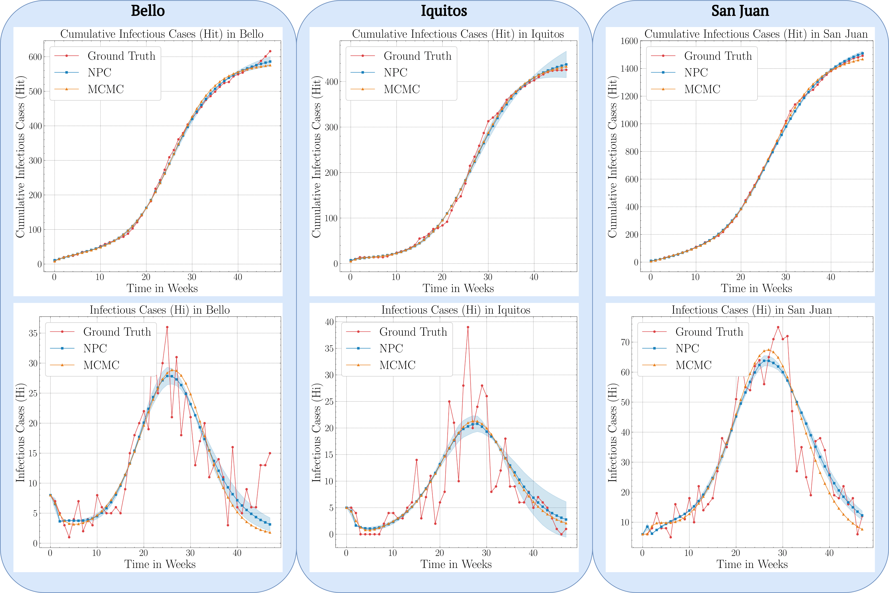
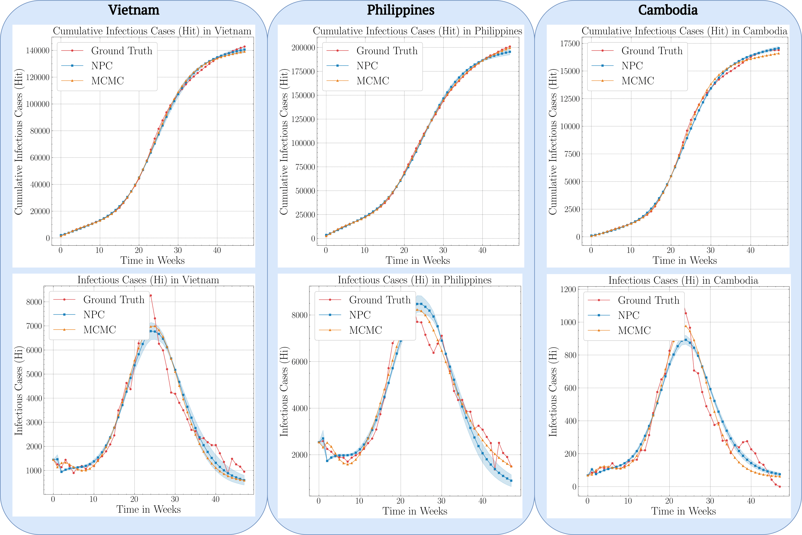

# Dengue ODE model

### Model description

The following ODE model is described in our paper on [neural parameter calibration for Dengue Outbreak Forecasting]() as follow:

$$
\begin{aligned}
    \frac{dMs(t)}{dt} &= \lambda - \beta_{m} \cdot \frac{Hi(t)}{H} \cdot Ms(t) - \mu_m \cdot Ms(t) \\
    \frac{dMe(t)}{dt} &= \beta_{m} \cdot \frac{Hi(t)}{H} \cdot Ms(t) - (\theta_m + \mu_m) \cdot Me(t) \\
    \frac{dMi(t)}{dt} &= \theta_{m} \cdot Me(t) - \mu_m \cdot Mi(t) \\
    \frac{dHs(t)}{dt} &= \mu_{h} \cdot H - \beta_{h} \cdot \frac{Mi(t)}{M} \cdot Hs(t) - \mu_h \cdot Hs(t) \\
    \frac{dHe(t)}{dt} &= \beta_{h} \cdot \frac{Mi(t)}{M} \cdot Hs(t) - (\theta_h + \mu_h) \cdot He(t) \\
    \frac{dHi(t)}{dt} &= \theta_{h} \cdot He(t) - (\gamma_h + \mu_h) \cdot Hi(t) \\
    \frac{dHr(t)}{dt} &= \gamma_{h} \cdot Hi(t) - \mu_h \cdot Hr(t) \\
    \frac{dHit(t)}{dt} &= \theta_{h} \cdot He(t)
\end{aligned}
$$

where $M(t) = Ms(t) + Me(t) + Mi(t)$ represents the mosquito population and $H(t) = Hs(t) + He(t) + Hi(t) + Hr(t)$ represents the human population. 

The compartmental ODE model of epidemics contains the following parameters:
- $\beta_h$:  Transmission rate from mosquito to human
- $\beta_m$:  Transmission rate from human to mosquito
- $\gamma_h$: Recovery rate of human population
- $\lambda$:  Recruitment of mosquito population
- $\mu_m$:    Mortality rate of mosquito population
- $\mu_h$:    Mortality rate of human population
- $\theta_h$: Transition rate from exposed to infectious humans
- $\theta_m$: Transition rate from exposed to infectious mosquitoes 

Note that these parameters were donated with a $\hat{\delta}$ symbol in the publication.
This model learns the transition parameters between these compartments and initial conditions of these compartments from data. Transition parameters can be time-dependent.

Regarding our analysis to the city level, figure below offers the performance in predicting dengue outbreaks of the NPC compared to the MCMC method in Bello, the Iquitos and San Juan.

<div style="text-align: center;">
  
</div>

Extending our analysis to the country level, figure below offers the performance in predicting dengue outbreaks of the NPC compared to the MCMC method in Vietnam, the Philippines and Cambodia.

<div style="text-align: center;">
  
</div>

Here, the red period is the ground truth, the blue shaded area is the NPC performance, and the orange line is the MCMC performance.

### Model parameters
The following are the default parameters for the Dengue model:
```yaml
Data:
  synthetic_data:
    # Number of generated data steps (= batch_size)
    num_steps: 48

    # Number of burn-in steps
    burn_in: 2

    # Time-step of ODE solver
    dt: 0.1

  # Section of training data to use as train and test data (default is entire training data)
  # Pass a python slice as an argument
  training_data_size: !slice [0, ~]
```

### Loading data
Instead of generating synthetic data, you can also load data from an `.h5` File.

```yaml
Data:
  load_from_dir: path/to/h5file
```

### Calibrating the Bello dataset
The dataset of Dengue figures for Bello from week 8 of 2014 to week 2 of 2015 can be found at `data/Dengue/bello/data.h5`,
and is calibrated in the `bello` configuration set:
```commandline
utopya run Dengue --cs bello --no-eval
```

### Calibrating the Iquitos dataset
The dataset of Dengue figures for Iquitos from week 6 of 2005 to week 1 of 2006 can be found at `data/Dengue/iquitos/data.h5`,
and is calibrated in the `iquitos` configuration set:
```commandline
utopya run Dengue --cs iquitos --no-eval
```

### Calibrating the San Juan dataset
The dataset of Dengue figures for San Juan from week 51 of 2000 to week 46 of 2001 can be found at `data/Dengue/sanjuan/data.h5`,
and is calibrated in the `sanjuan` configuration set:
```commandline
utopya run Dengue --cs sanjuan --no-eval
```

### Calibrating the Vietnam dataset
The dataset of Dengue figures for Vietnam from week 9 of 2017 to week 4 of 2018 can be found at `data/Dengue/vietnam/data.h5`,
and is calibrated in the `vietnam` configuration set:
```commandline
utopya run Dengue --cs vietnam --no-eval
```

### Calibrating the Philippines dataset
The dataset of Dengue figures for Philippines from week 9 of 2013 to week 5 of 2014 can be found at `data/Dengue/philippines/data.h5`, and is calibrated in the `philippines` configuration set:
```commandline
utopya run Dengue --cs philippines --no-eval
```

### Calibrating the Cambodia dataset
The dataset of Dengue figures for Cambodia from week 5 of 2013 to week 48 of 2013 can be found at `data/Dengue/cambodia/data.h5`, and is calibrated in the `cambodia` configuration set:
```commandline
utopya run Dengue --cs cambodia --no-eval
```